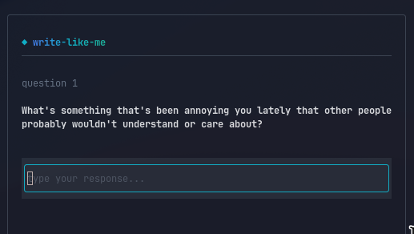

# write-like-me

**Make Claude write like you, not like a robot.**

A CLI tool that interviews you, analyzes your writing style, and generates a Claude Code skill that captures your actual voice — vocabulary, punctuation quirks, sentence structure, all of it.



## How it works

```
You answer questions    -->    AI analyzes your style    -->    Portable skill file
(type how you actually type)   (vocabulary, tone, quirks)       (drop into any project)
```

The tool asks you a series of questions designed to elicit different kinds of writing — casual opinions, technical explanations, quick reactions, longer thoughts. It then builds a detailed style profile and packages it as a Claude Code skill.

## Install

```bash
cargo install --path .
```

Or run directly:

```bash
cargo run
```

## Usage

```bash
export ANTHROPIC_API_KEY=sk-ant-...
write-like-me
```

Answer at least 5 questions (more = better results). Press `Esc` when finished. Press `Enter` to submit each response.

Then drop the generated skill into any project:

```bash
cp -r write-like-me-output/.claude /path/to/your/project/
```

Now ask Claude to "write like me" and it will match your style.

## Before / After

**Generic AI:**
> I'd be happy to help you with that! Here's a comprehensive overview of the situation. First, let's consider the key factors at play...

**With your style captured:**
> ok so basically the issue is — the cache invalidation is happening before the write confirms. classic race condition. I'd just throw a mutex around the whole block tbh, it's not hot path anyway

*(Your actual output will reflect however you write.)*

## Output

The tool creates `write-like-me-output/` containing:

- `style-profile.md` — Your analyzed writing style
- `.claude/skills/write-like-me.md` — The Claude Code skill
- `samples.json` — Raw Q&A data for re-analysis

## Requirements

- Rust 1.85+
- Anthropic API key

## License

MIT
